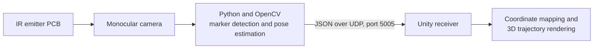

# Real-Time Spatial Trajectory Rendering in Unity

This research prototype uses infrared (IR) marker tracking for spatial interaction and real-time 3D trajectory rendering in Unity. A monocular camera observes the emitter, a Python/OpenCV pipeline estimates its position and orientation, and a Unity scene renders the resulting trajectory.

> **Prototype status.** This repository contains prototype source and design files. It is intended for study and reproduction with compatible hardware, not as a calibrated tracking product. The reported measurements below come from prototype evaluation; raw recordings and a repeatable benchmark harness are not included.

## System overview



- **Tracking:** Configurable two-LED position tracking or four-LED rectangular pose estimation, with candidate filtering and temporal tracking.
- **Transport:** Local UDP packets carrying position in millimetres and, when available, orientation.
- **Visualization:** Unity maps camera coordinates to scene coordinates, smooths points, filters near-duplicates, and extends a `LineRenderer` incrementally.
- **Hardware:** Altium schematic/PCB design and a printable enclosure model are provided as design artifacts.

## Repository layout

| Path | Contents |
| --- | --- |
| [`tracking/`](tracking/) | Python tracker, configuration, dependencies, and vision modules |
| [`unity/`](unity/) | Unity 2022.3 project with the demonstration scene and C# scripts |
| [`hardware/`](hardware/) | Altium source files and enclosure STL |
| [`docs/architecture.md`](docs/architecture.md) | Data flow, coordinate mapping, and interface notes |
| [`docs/configuration.md`](docs/configuration.md) | Key tracker settings and camera calibration guidance |
| [`docs/evaluation.md`](docs/evaluation.md) | Reported prototype measurements and limitations |

Generated caches, local Python environments, third-party demonstration assets, and raw evaluation media are excluded from this source repository.

## Requirements

- Python 3.9 or newer, a camera that can observe the IR markers, and the physical emitter with known LED geometry.
- Python packages in [`tracking/requirements.txt`](tracking/requirements.txt).
- Unity Editor version recorded by the project: **2022.3.62f2c1**. Open the `unity/` directory as a Unity project.
- Altium Designer only if you want to inspect or modify the PCB files. An STL viewer or slicer can open the enclosure.

## Run the prototype

1. Create a Python environment and install the tracker dependencies:

   ```bash
   cd tracking
   python3 -m venv .venv
   source .venv/bin/activate
   python -m pip install -r requirements.txt
   ```

2. Set the camera ID, LED geometry, exposure, and tracking thresholds in [`tracking/config.py`](tracking/config.py). The supplied configuration uses four LEDs in a 30 mm by 25 mm rectangle. Camera exposure controls depend on the device and may require adjustment. See the [configuration guide](docs/configuration.md).

3. Open `unity/` in Unity, load `Assets/Scenes/MainScene.unity`, and enter Play mode. The scene includes the UDP receiver and trajectory drawer. If your Unity installation cannot open the recorded editor version, use a compatible 2022.3 LTS editor and allow Unity to import the project.

4. In a separate terminal, run the tracker from `tracking/`:

   ```bash
   python ir_tracker.py
   ```

   The tracker sends to `127.0.0.1:5005` by default. Change `UNITY_IP` and `UNITY_PORT` in `config.py` when Unity runs elsewhere. Press `q` in the tracker window to quit.

The camera and emitter are necessary for live tracking. The repository does not include a camera recording or a hardware-free replay mode.

## Reported evaluation

| Measure | Reported result | Test context |
| --- | --- | --- |
| End-to-end latency | 72 ms optimized; 95 ms normal | High-speed camera footage and timestamp comparison |
| Static positioning error | 12 mm at 30-90 cm; 18 mm at 90-120 cm | Fixed-point measurements against a laser rangefinder |
| Refresh rate | 58 Hz | Unity Profiler under 2K camera input |
| Complex-curve reproduction | 92% | Spatial-drawing demonstration; metric details and raw data unavailable |

These are **reported prototype results**, not automated checks of the files in this repository. See [evaluation notes](docs/evaluation.md) for the operating constraints.

## License

The project source is released under the [MIT License](LICENSE). Unity and other external tools remain subject to their own terms.
